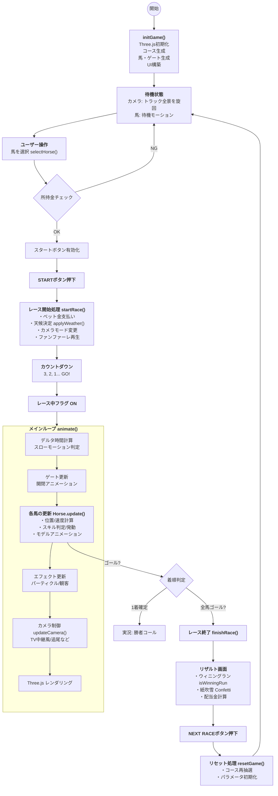

```mermaid
graph TD
    %% 初期化フェーズ
    Start((開始)) --> Init["<b>initGame()</b><br/>Three.js初期化<br/>コース生成<br/>馬・ゲート生成<br/>UI構築"]
    Init --> IdleState["<b>待機状態</b><br/>カメラ: トラック全景を旋回<br/>馬: 待機モーション"]

    %% ユーザー操作フェーズ
    IdleState --> UserSelect["<b>ユーザー操作</b><br/>馬を選択 selectHorse()"]
    UserSelect --> BetCheck{所持金チェック}
    BetCheck -- OK --> EnableStart[スタートボタン有効化]
    BetCheck -- NG --> IdleState
    EnableStart --> UserStart[<b>STARTボタン押下</b>]

    %% レース準備フェーズ
    UserStart --> PreRace["<b>レース開始処理 startRace()</b><br/>・ベット金支払い<br/>・天候決定  applyWeather()<br/>・カメラモード変更<br/>・ファンファーレ再生"]
    PreRace --> Countdown["<b>カウントダウン</b><br/>3, 2, 1... GO!"]
    
    %% メインループ (Animate)
    subgraph MainLoop ["<b>メインループ animate()</b>"]
        UpdateDelta[デルタ時間計算<br/>スローモーション判定]
        updateGates[ゲート更新<br/>開閉アニメーション]
        updateHorses["<b>各馬の更新 Horse.update()</b><br/>・位置/速度計算<br/>・スキル判定/発動<br/>・モデルアニメーション"]
        updateEffects[エフェクト更新<br/>パーティクル/観客]
        updateCam["カメラ制御 updateCamera()<br/>TV中継風/追尾など"]
        Render[Three.js レンダリング]
        UpdateDelta --> updateGates --> updateHorses --> updateEffects --> updateCam --> Render
    end
    Countdown --> RaceStarted[<b>レース中フラグ ON</b>]
    RaceStarted --> MainLoop
    %% レース中の判定
    updateHorses -- ゴール? --> CheckWinner{着順判定}
    CheckWinner -- 1着確定 --> AnnounceWin[実況: 勝者コール]
    CheckWinner -- 全馬ゴール? --> FinishRace["<b>レース終了 finishRace()</b>"]
    
    %% リザルトフェーズ
    FinishRace --> ResultState["<b>リザルト画面</b><br/>・ウィニングラン isWinningRun<br/>・紙吹雪 Confetti<br/>・配当金計算"]
    
    ResultState --> UserReset[<b>NEXT RACEボタン押下</b>]
    UserReset --> ResetProcess["<b>リセット処理 resetGame()</b><br/>・コース再抽選<br/>・パラメータ初期化"]
    ResetProcess --> IdleState
```