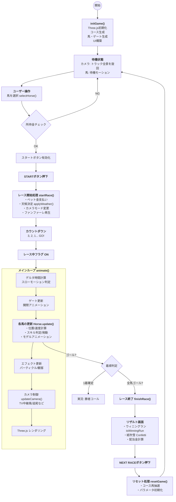

# Toy Derby: Grand Prix 🐎

ブラウザで楽しめる、リッチな3D競馬観戦シミュレーションゲームです。
Three.jsによる臨場感あふれるレースシーン、個性的な馬たちのスキル発動、そして興奮の実況システムを体験してください。

## 🎮 特徴 (Features)

- **3Dグラフィックス**: Three.jsを使用した本格的な3Dレース描写。
- **多彩な演出**: TV中継のようなダイナミックなカメラワーク、天候変化、スキルエフェクト、スローモーションゴール。
- **個性豊かな競走馬**: それぞれ異なる外見、パラメーター、固有スキル（必殺技）を持つユニークな馬たちが登場。
- **実況システム**: レース展開に合わせてリアルタイムにテキスト表示＆音声合成による読み上げを行います。
- **ベッティング**: 推し馬に賭けて所持金を増やすゲーム要素を搭載。

## 🕹️ 遊び方 (How to Play)

1. **馬を選ぶ**: エントリーしている5頭の馬の中から、オッズや特徴を見て賭ける馬をクリックして選びます。
2. **レース開始**: 「START RACE」ボタンを押してレーススタート！所持金から100Gがベットされます。
3. **観戦**: 
    - 自動でカメラが切り替わりますが、右上のボタンで「追尾」「上空」「サイド」「TVモード」を手動で切り替えることも可能です。
    - 馬たちのスキル発動（カットイン演出）や位置取りに注目してください。
4. **結果**: 選んだ馬が見事1着になれば、オッズに応じた賞金を獲得できます。
5. **次へ**: 「NEXT RACE」で次のレースへ。コースはランダムに変更されます。

## 🐴 登場する馬 (Horses)

| 名前 | カラー | 特徴 | スキル |
| --- | --- | --- | --- |
| **ホワイトウィンド** | ⚪ 白 | 天使の翼を持つ。 | **Divine Wind**: ラストスパート超加速 |
| **チョコチップ** | 🟤 茶 | チョコチップ模様。 | **Sugar Rush**: 中盤で爆発的な加速 |
| **ブラックジャック** | ⚫ 黒 | サイバーバイザー装備。 | **Shadow Step**: スタミナ減らずに加速 |
| **ゴールデンボーイ** | 🟡 金 | 王冠を被った王者の風格。 | **Gold Aura**: 全体的な速度底上げ |
| **シルバーブレット** | ⚪ 銀 | ロケットブースター搭載。 | **Bullet Time**: ゴール直前で一瞬の伸び |

## 🛠️ 技術スタック

*   **HTML5 / JavaScript (Vanilla)**: フレームワークなしのピュアな実装。
*   **Three.js**: 3Dレンダリング、モデル生成（プリミティブの組み合わせ）、パーティクルシステム。
*   **TailwindCSS**: モダンで美しいUIスタイリング。
*   **Web Audio API**: BGM、効果音のプロシージャル生成。
*   **Web Speech API**: ブラウザ標準機能による音声実況。

## 📊 プログラムフローチャート

